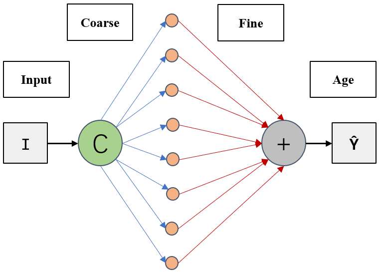
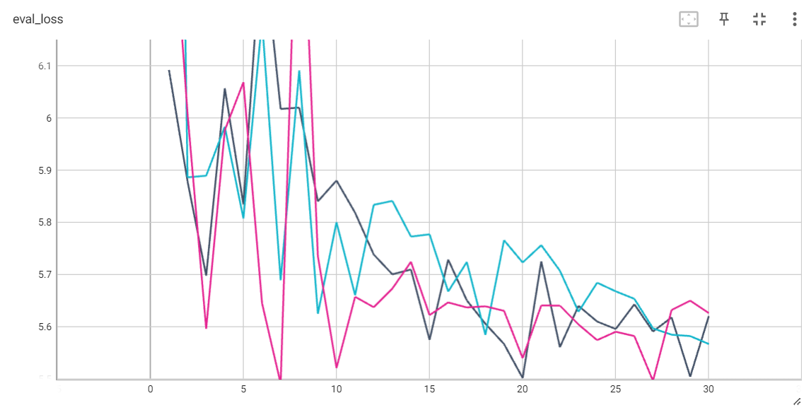

# Age Esimation on Human Faces

## Dataset

[UTKFace](https://www.kaggle.com/datasets/jangedoo/utkface-new?resource=download)

**It seems that all images in `aligned_cropped` are in shape (200, 200, 3)**

## Architecture for Coarse-to-Fine

## CNN-Classifier validation loss

## Checkpoints

We have uploaded some here, if you are interested in our coarse-to-fine method, pleas check
[https://drive.google.com/drive/folders/1l3PR1kZpfweDzx2pR9s_x9um8_e1vXs9?usp=drive_link](https://drive.google.com/drive/folders/1l3PR1kZpfweDzx2pR9s_x9um8_e1vXs9?usp=drive_link)

## log files are in `log`